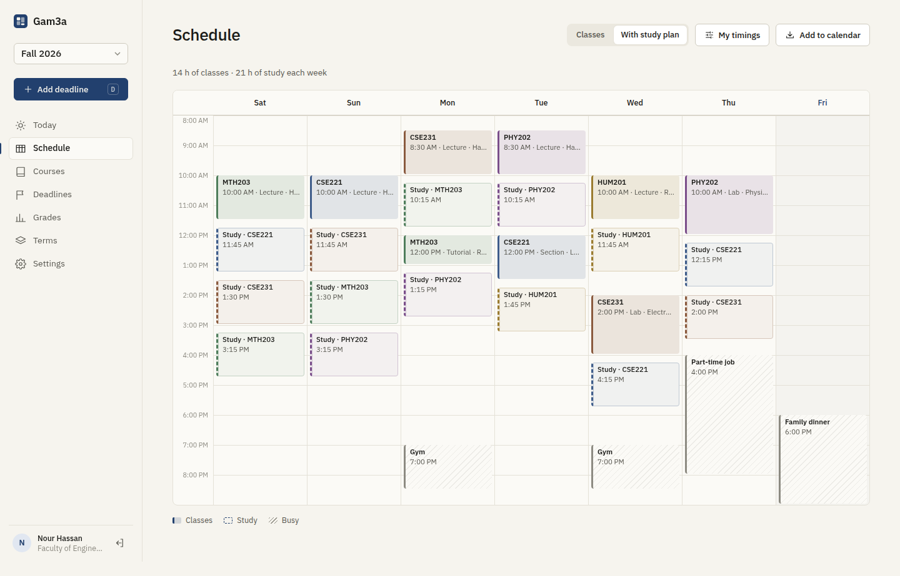
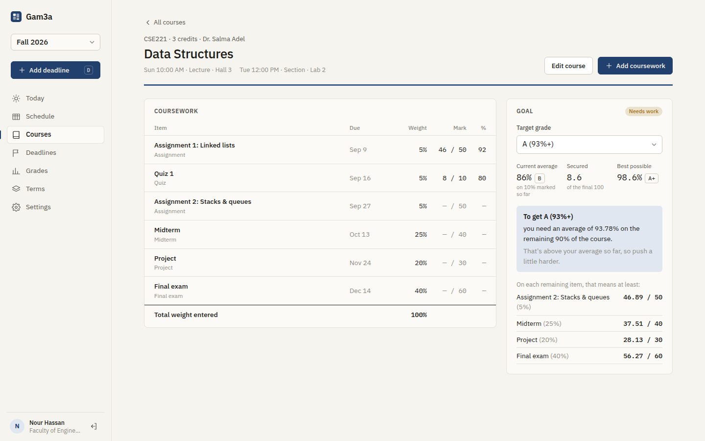
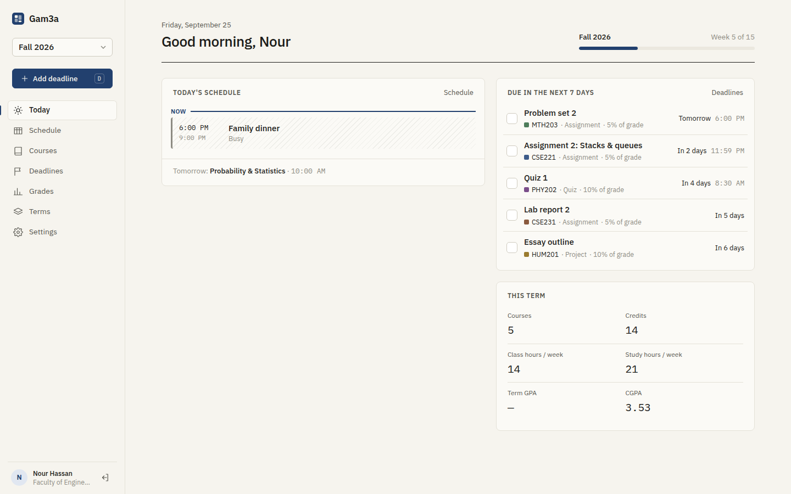
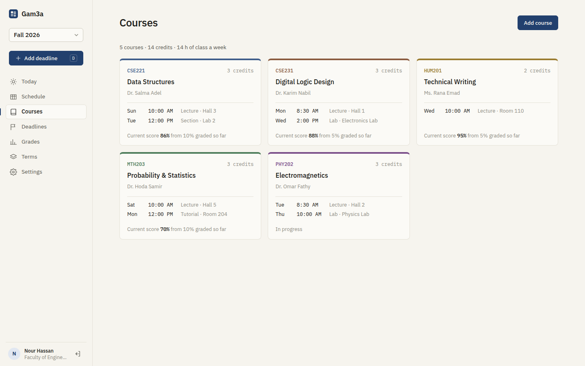
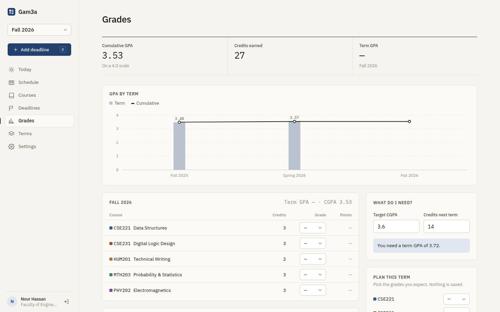
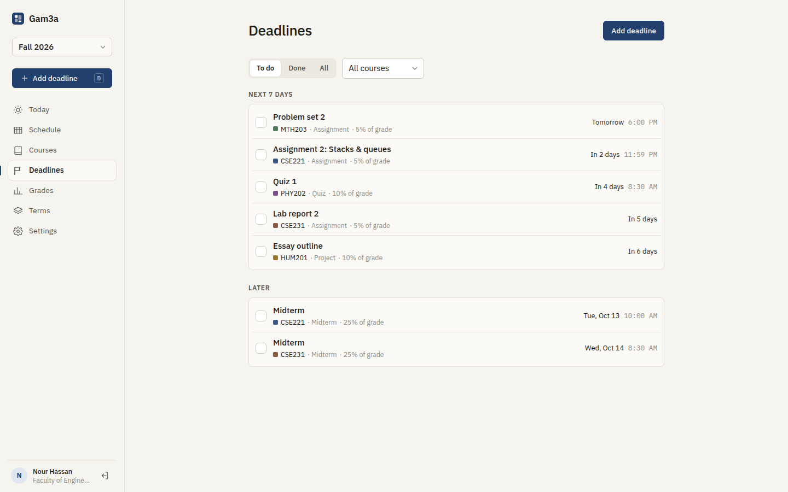
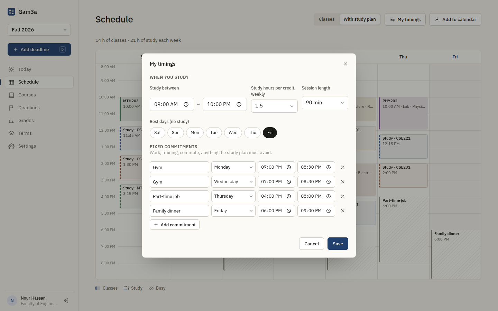
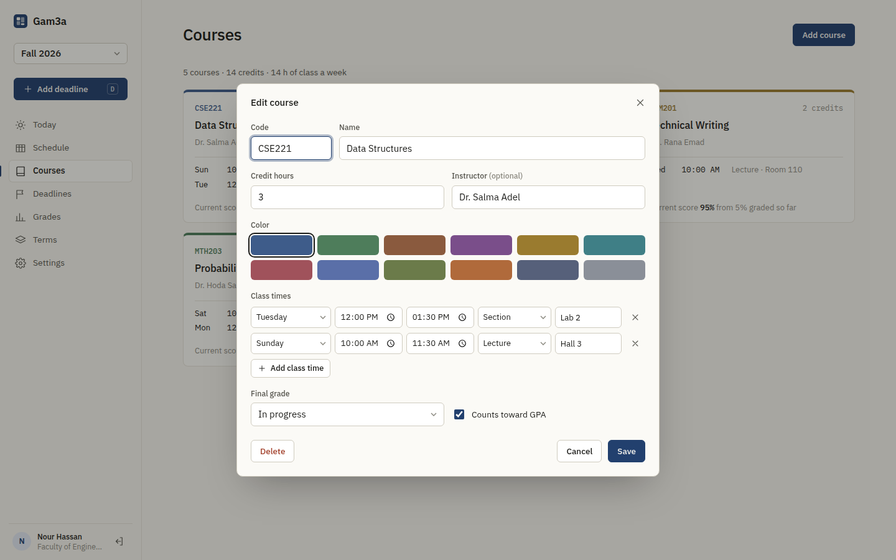
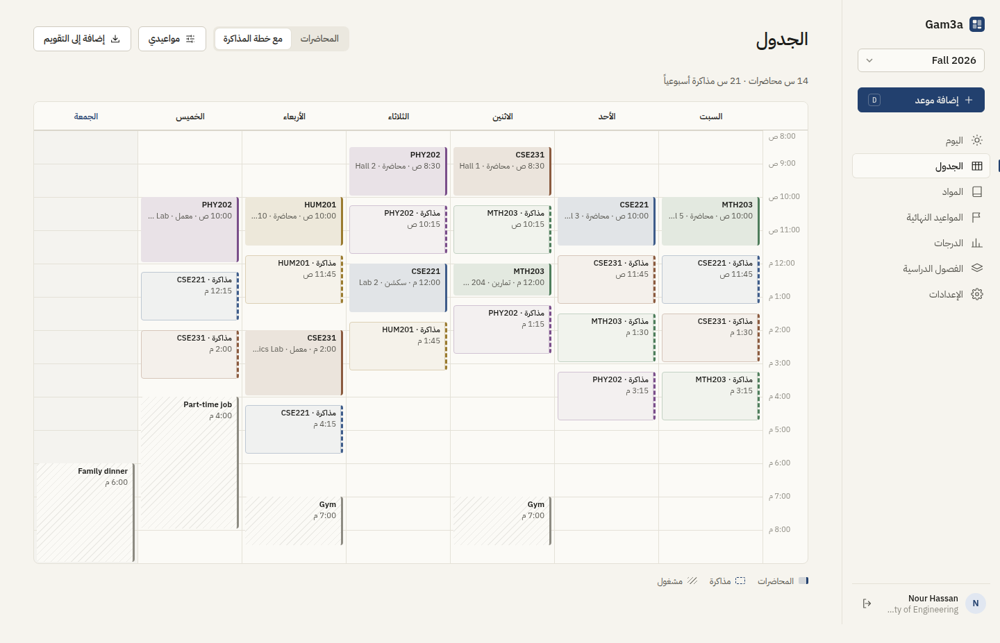
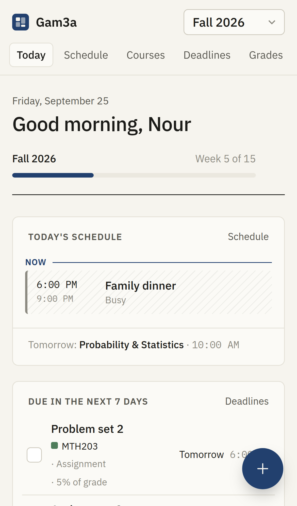

<p align="center">
  
</p>

<h1 align="center">Gam3a</h1>

<p align="center">
  A university planner: terms, courses and classes, an auto-generated study schedule,
  deadlines, and term GPA / CGPA. In English and Arabic.
  <br>
  <b>FastAPI · SQLAlchemy · React · TypeScript · TanStack Query</b>
</p>

<p align="center">
  <a href="https://github.com/AdelAd8l/gam3a/actions/workflows/ci.yml"></a>
  
  
  
</p>





*Gam3a (جامعة) means "university" in Arabic.*

## Features

- **Terms** with start and end dates, and a "week 5 of 15" progress bar. Switch between terms from the sidebar.
- **Courses** with code, credit hours, instructor, color and weekly class times: lectures, sections, labs and tutorials, each with day, time and room.
- **My timings:** your fixed commitments (job, gym, commute), the hours you like to study, session length, study hours per credit and rest days.
- **Auto-generated study plan:** sessions are sized by credit hours and fitted around classes and commitments, spread across the week (see [how it works](#how-the-study-planner-works)).
- **Clash detection:** overlapping classes or commitments are flagged.
- **Weekly timetable:** a full grid on desktop and a day-by-day agenda on the phone.
- **Calendar export:** a `.ics` file with every class repeating weekly until the term ends, plus deadlines. It works with Google Calendar, Apple Calendar and Outlook.
- **Deadlines:** assignments, quizzes, midterms, finals and projects, with due date and time and weight. Marks are entered as they appear on the paper, e.g. **28 / 30**. Deadlines are grouped into overdue, next 7 days and later, and ticked off with a checkbox.
- **Course page and goal calculator:** each subject has its own page listing its coursework, with:
  - your current average and letter
  - the course marks you've **secured**
  - the **best grade still possible**
  - **what you need on the remaining work** to reach your target, shown per item: "at least 39.33 / 40 on the midterm, 59 / 60 on the final"
  - a warning when the weights you've entered don't add up
  - a one-click "set final grade" once everything is marked
- **Your grade cut-offs:** A+ ≥ 97, A ≥ 93, A- ≥ 90 … by default. You can edit them to match your university, and set a default goal for every course.
- **GPA and CGPA:** term and cumulative GPA on a **4.0** or **5.0** scale, with P/W/I grades excluded, and a chart across terms.
- **CGPA before and after each term:** every term shows the CGPA going in, the term GPA and the CGPA coming out, with the change (e.g. 3.48 → 3.57 → 3.53, +0.05).
- **"What do I need?":** the term GPA you need to reach a target CGPA.
- **"Plan this term":** pick expected grades and see your projected GPA and CGPA without saving anything.
- **Today page:** today's classes and study blocks with a *now* marker, what's due this week, and term stats.
- **English and Arabic:** full right-to-left layout, IBM Plex Sans Arabic, and localized days, dates and times. The week can start on Saturday, Sunday or Monday.
- **Installable on your phone:** web-app manifest, home-screen icon and a notch-aware layout.
- **Accounts:** bcrypt passwords, httpOnly session cookies and strict per-user data isolation.

<table>
  <tr>
    <td></td>
    <td></td>
  </tr>
  <tr>
    <td></td>
    <td></td>
  </tr>
  <tr>
    <td></td>
    <td></td>
  </tr>
  <tr>
    <td></td>
    <td align="center"></td>
  </tr>
</table>

## Use it on your phone (free hosting)

1. **Database:** create a free Postgres database on [Neon](https://neon.tech) and copy its connection string (`postgresql://…`).
2. **Deploy:** click [**Deploy to Render**](https://render.com/deploy?repo=https://github.com/AdelAd8l/gam3a), sign in with GitHub, and paste the connection string into `GAM3A_DATABASE_URL`. `render.yaml` sets up everything else.
3. **Sign up:** open your `…onrender.com` link and create your account.
4. **Close sign-ups:** in Render → *Environment*, set `GAM3A_ALLOW_SIGNUP=false`.
5. **Install:**
   - **iPhone (Safari):** Share → *Add to Home Screen*
   - **Android (Chrome):** ⋮ → *Install app*

> The free Render plan sleeps after 15 idle minutes, so the first open after a break takes about 30–50 s.

## Run it locally

### Docker

```bash
cp .env.example .env
echo "GAM3A_SECRET_KEY=$(python3 -c 'import secrets; print(secrets.token_hex(32))')" >> .env
echo "GAM3A_DEMO=true" >> .env        # optional demo student with three terms of data
docker compose up --build             # http://localhost:8000
```

### Development

```bash
# backend (Python 3.11+)
cd backend
python -m venv .venv && source .venv/bin/activate
pip install -r requirements-dev.txt
python -m app.seed                    # optional: demo@gam3a.dev / demo-password
uvicorn app.main:app --reload         # API docs at http://localhost:8000/docs

# frontend (Node 20+), in another terminal
cd frontend
npm install
npm run dev                           # http://localhost:5173
```

## How the study planner works

`backend/app/planner.py` is a small, deterministic scheduler, so the same inputs always give the same week:

1. **Free time:** each day's free time is your study window minus classes and commitments. A 15-minute buffer is kept after each one, and rest days are skipped.
2. **Weekly need:** each unfinished course needs `credits × hours per credit` hours a week, split into sessions of your chosen length. The last session is shorter if needed.
3. **Placement:** sessions are dealt out round-robin, biggest courses first, so no course is starved. Each goes to the **least-loaded day that doesn't already have that course**, in the earliest gap long enough to hold it, with 15 minutes between sessions.
4. **Warnings:** anything that doesn't fit is reported, with a hint to widen your study hours or free up a day.

The planner is covered by unit tests: it respects classes, buffers and rest days, spreads sessions across days, matches the credit hours exactly, and reports leftovers.

## GPA rules

| Scale | A+ | A | A- | B+ | B | B- | C+ | C | C- | D+ | D | F |
|---|---|---|---|---|---|---|---|---|---|---|---|---|
| 4.0 | 4.0 | 4.0 | 3.7 | 3.3 | 3.0 | 2.7 | 2.3 | 2.0 | 1.7 | 1.3 | 1.0 | 0 |
| 5.0 | 5.0 | 4.75 | – | 4.5 | 4.0 | – | 3.5 | 3.0 | – | 2.5 | 2.0 | 1.0 |

- **GPA formula:** GPA = Σ(points × credits) / Σ(credits), counting graded courses only.
- **Special grades:** **P** (pass) earns credits but isn't in the GPA. **W** and **I** are neither. **F** counts in the GPA but earns nothing.
- **CGPA:** accumulated term by term, in date order.

## How the goal calculator works

- **Terms:** every coursework item has a *weight* (its share of the course grade) and a *mark* (e.g. 28 / 30 → 93.3%).
- **Secured:** Σ weight × mark%, the course points already in the bag, out of 100.
- **Remaining:** 100 − the weight marked so far. This includes coursework you haven't entered yet.
- **Required:** (target cut-off − secured) / remaining, the average you need on everything still to come. For each upcoming item it's also shown in that item's own points.
- **Status:** **Secured** when secured ≥ target. **Out of reach** when secured + remaining < target. Otherwise **on track** or **needs work**, depending on whether your average so far is at least the required one.

## How it's built

```
gam3a/
├── backend/app/
│   ├── models.py        terms, courses, meetings, commitments, assessments
│   ├── planner.py       study-plan generator (pure functions)
│   ├── grading.py       grade scales and GPA maths
│   ├── routers/         auth, terms, courses, busy, assessments, plan (+ .ics), grades
│   └── seed.py          demo student
├── backend/tests/       API, planner and GPA tests
├── frontend/src/
│   ├── lib/             typed API client, i18n (en/ar), date/time helpers
│   ├── components/      week grid, agenda, dialogs
│   └── pages/           Today, Schedule, Courses, Deadlines, Grades, Terms, Settings
├── Dockerfile           builds the React app and serves it from FastAPI
└── render.yaml          one-click deploy
```

## Configuration

| Variable | Default | |
|---|---|---|
| `GAM3A_SECRET_KEY` | dev key | **Set in production.** Signs session tokens. |
| `GAM3A_DATABASE_URL` | `sqlite:///./gam3a.db` | SQLite or Postgres (`postgresql://…` works as-is) |
| `GAM3A_ALLOW_SIGNUP` | `true` | `false` keeps a personal server private |
| `GAM3A_COOKIE_SECURE` | `false` | `true` behind HTTPS |
| `GAM3A_DEMO` | `false` | Seeds a demo student and shows a demo button |

## Testing

```bash
cd backend && ruff check . && pytest              # set TEST_DATABASE_URL to run on Postgres
cd frontend && npm run lint && npm run build
```

## Roadmap

- Drag study sessions to pin them
- Attendance and absence limits per course
- Exam-period mode with revision planning
- Reminders (web push)

## License

MIT © [AdelAd8l](https://github.com/AdelAd8l)
